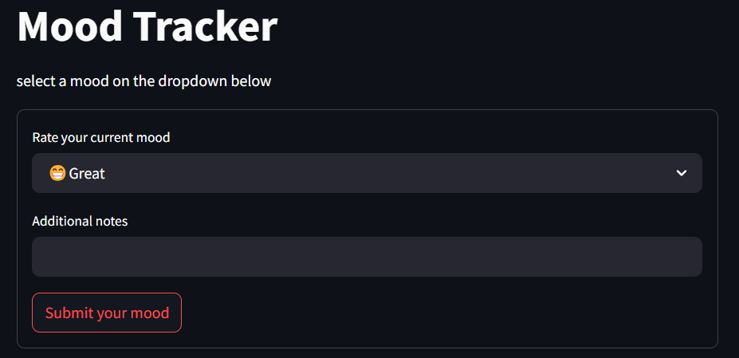
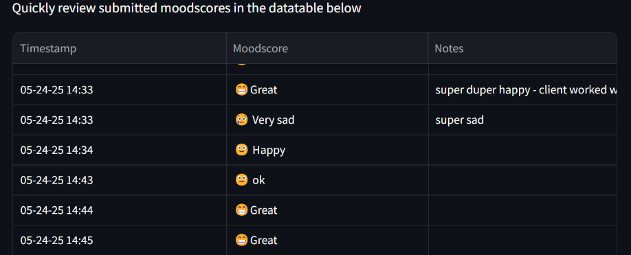
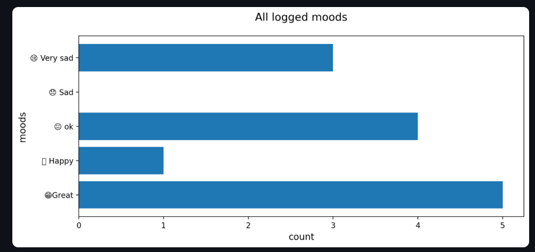

# Mood Tracker Internal Use Demo with Dashboard

Internal operations teams may handle countless tickets per day. This simple internal tool can be used to log those moods throughout the day, tallying and visualizing the total mood counts.

# Technologies
- Frontend: Streamlit (dashboard)
- Deployment: Streamlit Cloud
- Backend Languages: Python
- Data Handling: Pandas
- Visualization: Matplotlib

#Deployment
Deployed for demo at MoodTrackdemo.streamlit.app

#Usage

  

 Users can input moods using a dropdown
 

  

 Users can quickly review previously submitted moods along with timestamps and notes
 

  

 Quickly visualize a running tally count of submitted moods - Auto updating with form submission
 
